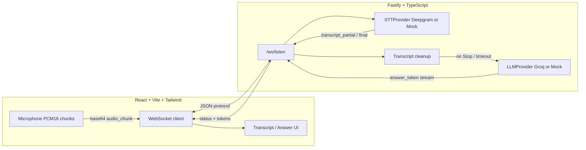

# Candidate Answer Assistant (MVP)

**Purpose.** A **Listen → Stop** mock interview helper: stream microphone audio to the server, transcribe in real time, then when you tap **Stop** (or a hard timeout fires) the server sends the live transcript through the LLM and streams a short **text** candidate-style answer. **Audio in → text out only** (no TTS, no AI voice, no audio-to-audio).

**Disclaimer.** This app is for **mock interview practice only.** A visible notice also appears in the UI: *“For mock interview practice only.”*

**Privacy / data.** **No database, no authentication, no saved history, no file persistence.** Everything lives in memory for the current browser session and active WebSocket connection.

---

## Architecture



---

## Latency strategy

- **Small PCM chunks** (~180ms pacing on the client) over WebSocket (no “record full file then upload”).
- **Streaming STT** (Deepgram live) with **interim results** and **endpointing** so partial transcripts arrive quickly.
- **`cleanQuestionText`** (light string cleanup only; no auto “question detected” step).
- **Groq streaming completions** for fast time-to-first-token, with **`ANSWER_MAX_TOKENS` (~1200 default)** and temperature **0.35** for natural, substantive answers.
- **No database / disk I/O** on the hot path.
- **Per-connection in-memory session** only; all timers and STT streams are torn down on close.

---

## Setup

### Prerequisites

- Node.js 18+
- npm (or compatible package manager)

### Environment

Copy `.env.example` to **`.env`** in the repo root and/or **`server/.env`**. The server loads **both** (repo root first, then `server/.env` overrides).

### Install

```bash
cd server && npm install
cd ../client && npm install
```

---

## Run

**Terminal 1 — API + WebSocket**

```bash
cd server
npm run dev
```

**Terminal 2 — Frontend**

```bash
cd client
npm run dev
```

Open the printed local URL (default `http://localhost:5173`). Ensure `CLIENT_ORIGIN` matches the client origin for CORS.

**WebSocket URL.** By default the client connects to `ws://localhost:3001/ws/listen`. To override, add `client/.env.local`:

```
VITE_WS_URL=ws://localhost:3001/ws/listen
```

---

## Environment variables

| Variable | Description |
|----------|-------------|
| `DEEPGRAM_API_KEY` | Deepgram API key for live STT. If empty, **`MockSTTProvider`** runs. |
| `GROQ_API_KEY` | Groq API key. If empty, **`MockLLMProvider`** runs. |
| `GROQ_MODEL` | Groq model id (default `openai/gpt-oss-120b` for detailed interview answers; override if your project uses another id). |
| `DEEPGRAM_MODEL` | Deepgram live model (default `nova-3-general`; `nova-3` is an alias in the same family on many accounts). |
| `PORT` | HTTP port (default `3001`). |
| `CLIENT_ORIGIN` | Allowed CORS origin for the SPA (default `http://localhost:5173`). |
| `VITE_WS_URL` | (Client) WebSocket URL for `/ws/listen`. |

---

## Listen → Stop flow

1. User clicks **Listen** → microphone permission → WebSocket opens → server starts STT for this connection.
2. Client streams **live** `audio_chunk` messages (base64 PCM16 mono; `sample_rate` from `AudioContext`).
3. Server forwards audio to Deepgram (or mock), forwards **`transcript_partial` / `transcript_final`** to the client.
4. User clicks **Stop** → server **`finalize()`**s the live Deepgram stream, waits briefly for trailing finals, tears down STT, runs **`cleanQuestionText`** on the accumulated transcript, then streams **`answer_token`** + **`answer_done`** (or **`error`** if nothing was captured).
5. UI shows **done** when the answer finishes; **Listen again** starts a fresh listen.
6. **Clear** resets local UI and server session state without persisting data.
7. If **`MAX_LISTENING_MS`** elapses, the server behaves like Stop: it answers from whatever transcript exists, or errors if empty.

---

## Why no database?

The product goal is **minimum latency** and **zero retention**. A database would add round-trips, storage policy, and compliance surface area that this MVP explicitly avoids.

---

## Current-session memory model

- **`SessionState`** is held in a small object per WebSocket connection on the server.
- When the socket **closes**, STT is stopped, timers cleared, and the context is **eligible for GC** (no global transcript store).
- The browser keeps **no history** beyond what is on screen; **Clear** wipes local state.

---

## Mock providers (no API keys)

- Leave **`DEEPGRAM_API_KEY`** unset → **`MockSTTProvider`**: simulates transcription only when incoming PCM chunks rise above a **silence (RMS) threshold** so an open mic with no speech does not auto-fill the canned demo line.
- Leave **`GROQ_API_KEY`** unset → mock streamed answer text.

With both unset you can still run end-to-end locally to validate timing, UI, and WebSocket protocol.

---

## Production targets

- **STT:** Deepgram streaming (`@deepgram/sdk` live client, PCM16 mono; `sample_rate` matches the browser `AudioContext`).
- **LLM:** Groq streaming chat completions (`groq-sdk`), model from `GROQ_MODEL`, `max_tokens` from server `ANSWER_MAX_TOKENS` (default 1200 for substantive answers).

---

## TypeScript

Both packages use **strict** TypeScript (`server` uses `tsc`; `client` uses `tsc` + Vite).
